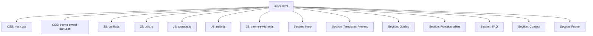
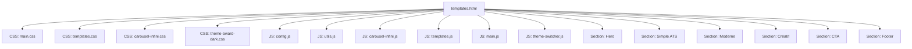
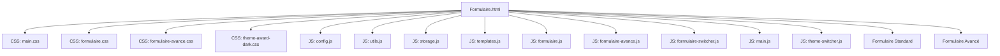
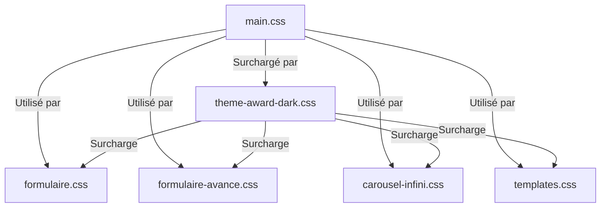
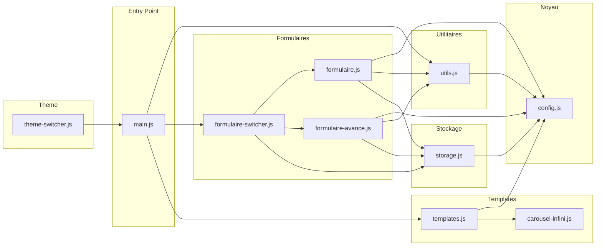
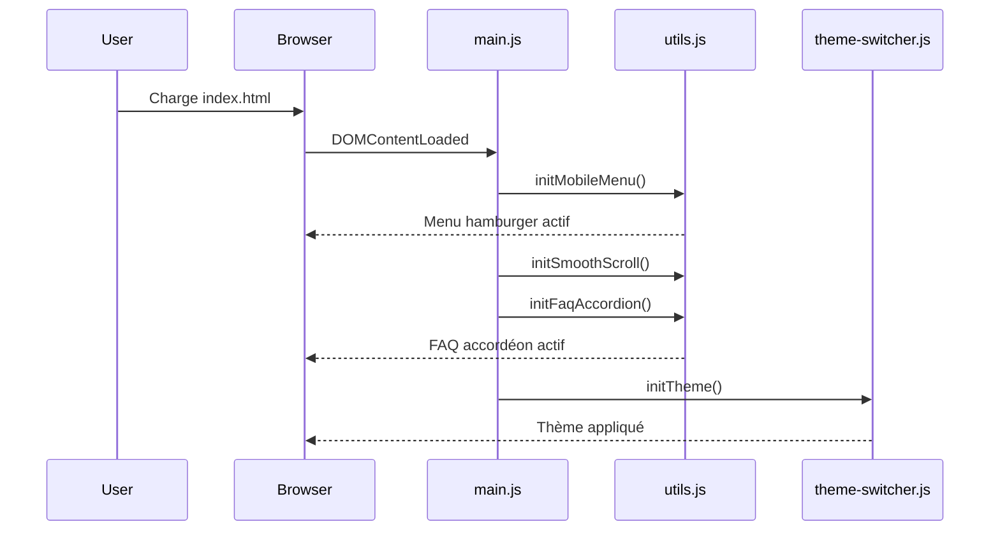
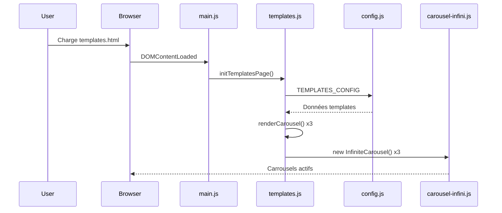
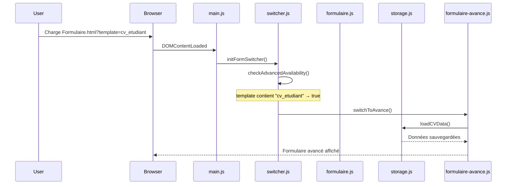
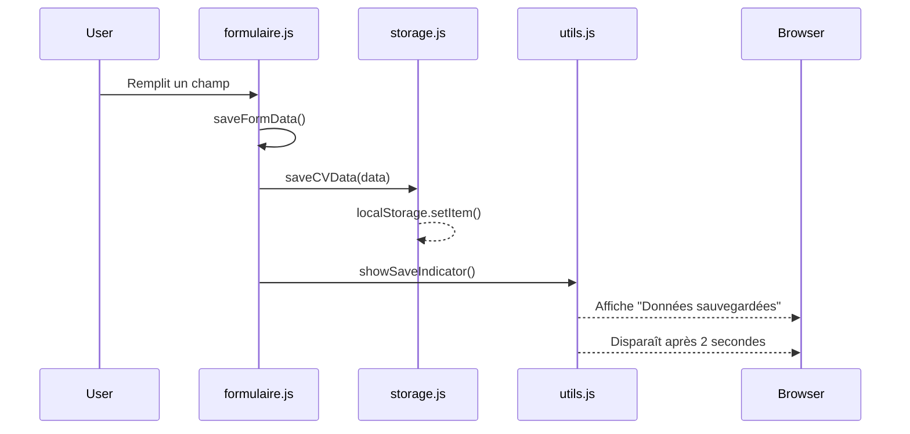

# Analyse Détaillée des Relations entre Fichiers - CV Builder

## 📁 STRUCTURE COMPLÈTE DU PROJET

```
projet/
├── index.html
├── templates.html
├── Formulaire.html
├── css/
│   ├── main.css
│   ├── theme-award-dark.css
│   ├── formulaire.css
│   ├── formulaire-avance.css
│   ├── carousel-infini.css
│   └── templates.css
├── js/
│   ├── config.js
│   ├── utils.js
│   ├── storage.js
│   ├── theme-switcher.js
│   ├── carousel-infini.js
│   ├── templates.js
│   ├── formulaire.js
│   ├── formulaire-avance.js
│   ├── formulaire-switcher.js
│   └── main.js
└── Assets/
    └── Cv/
        └── (images des templates)
```

---

## 🗺️ 1. DIAGRAMME DES RELATIONS GLOBALES

```
                    ┌─────────────────────────────────────────────────────────┐
                    │                      index.html                         │
                    │                   (Page d'accueil)                       │
                    └─────────────────────────────────────────────────────────┘
                                              │
                    ┌─────────────────────────┼─────────────────────────┐
                    │                         │                         │
                    ▼                         ▼                         ▼
            ┌───────────────┐         ┌───────────────┐         ┌───────────────┐
            │  templates.html│◄────────│ Formulaire.html│────────►│  templates.html│
            │ (Galerie)      │         │   (Formulaire) │         │   (Redirection)│
            └───────────────┘         └───────────────┘         └───────────────┘
                    │                         │
                    │                         │
                    ▼                         ▼
            ┌───────────────┐         ┌───────────────┐
            │   Carrousel   │         │   2 Formulaires│
            │    Infini     │         │ (Std/Avancé)   │
            └───────────────┘         └───────────────┘
```

---

## 📄 2. ANALYSE DES FICHIERS HTML

### 2.1 `index.html` - Page d'accueil



| Section | Éléments | Interactions |
|---------|----------|--------------|
| **Hero** | Titre, sous-titre, 2 CTA | Liens vers Formulaire.html et templates.html |
| **Templates Preview** | 3 cartes (ATS, Moderne, Créatif) | Liens vers templates.html#simple, #moderne, #creatif |
| **Guides** | 3 cartes (Visuel, Vidéo, PDF) | Liens externes (#) |
| **Fonctionnalités** | 3 cartes avec icônes | Style fixe sur fond sombre |
| **FAQ** | Accordéon avec 3 questions | Contrôlé par `utils.js: initFaqAccordion()` |
| **Contact** | 2 boutons (Telegram, Email) | Liens externes |
| **Footer** | Logo, slogan, liens sociaux, copyright | Variables CSS dynamiques |

**Points d'entrée JavaScript :**
- `initMobileMenu()` - Gère le menu hamburger
- `initSmoothScroll()` - Navigation interne fluide
- `initFaqAccordion()` - FAQ accordéon
- `initTheme()` - Basculement clair/sombre

---

### 2.2 `templates.html` - Galerie des templates



| Section | Contenu | Source de données |
|---------|---------|-------------------|
| **Hero** | Titre, sous-titre, lien retour | HTML statique |
| **Simple ATS** | Carrousel #carousel-ats | `TEMPLATES_CONFIG.ats` |
| **Moderne** | Carrousel #carousel-moderne | `TEMPLATES_CONFIG.moderne` |
| **Créatif** | Carrousel #carousel-creatif | `TEMPLATES_CONFIG.creatif` |
| **CTA** | Bouton Telegram | Lien externe |
| **Footer** | Logo, liens, copyright | Variables CSS |

**Flux de données templates :**
```
config.js: TEMPLATES_CONFIG
        ↓
templates.js: renderCarousel()
        ↓
templates.html: #carousel-ats, #carousel-moderne, #carousel-creatif
        ↓
carousel-infini.js: InfiniteCarousel class
        ↓
Affichage final
```

---

### 2.3 `Formulaire.html` - Formulaire de saisie



| Section | Contenu | Fonctions associées |
|---------|---------|---------------------|
| **Type Template** | 2 champs readonly | `getURLParams()` |
| **Informations** | 9 champs + photo | `loadFormData()`, `saveFormData()` |
| **Expériences** | Liste dynamique | `addExperience()`, `removeExperience()` |
| **Formations** | Liste dynamique | `addFormation()`, `removeFormation()` |
| **Compétences** | Liste dynamique | `addCompetence()`, `removeCompetence()` |
| **Langues** | Liste dynamique | `addLangue()`, `removeLangue()` |
| **Actions** | 2 boutons | `saveForLater()`, `generateCV()` |

**Ordre d'initialisation critique :**
```javascript
1. config.js     // Variables globales
2. utils.js      // Fonctions utilitaires
3. storage.js    // Gestion localStorage
4. templates.js  // Pour les URLs templates
5. formulaire.js // Formulaire standard
6. formulaire-avance.js // Formulaire avancé
7. formulaire-switcher.js // Basculement
8. main.js       // Point d'entrée
9. theme-switcher.js // Thème
```

---

## 🎨 3. ANALYSE DES FICHIERS CSS

### 3.1 Hiérarchie et ordre de chargement



### 3.2 `main.css` - Thème clair (fichier principal)

| Composant | Rôle | Variables définies |
|-----------|------|-------------------|
| `:root` | Variables globales thème clair | `--warm-orange`, `--warm-coral`, `--warm-cream` |
| `body` | Styles de base | Fond crème, police Inter |
| `header` | Navigation fixe | Backdrop blur, bordure |
| `.hero-gradient` | Bannière principale | Dégradé sunset |
| `.btn-primary`, `.cta-button` | Boutons principaux | Blanc sur orange |
| `.form-section` | Conteneurs formulaire | Bordure arrondie, ombre |
| `.faq-answer` | FAQ accordéon | `max-height: 0` → `300px` |
| `footer` | Pied de page | Dégradé sunset |
| `@media (max-width: 768px)` | Responsive mobile | Menu hamburger |

**Variables critiques :**
```css
--warm-orange: #FF6B35;    /* Primaire */
--warm-coral: #FF8C69;      /* Secondaire */
--warm-cream: #FFF8F0;      /* Fond */
--soft-charcoal: #2C2C2C;   /* Texte */
```

### 3.3 `theme-award-dark.css` - Thème sombre

| Composant | Rôle | Surcharge |
|-----------|------|-----------|
| `:root` | Variables thème sombre | `--award-primary: #00FF9D` |
| `body.award-dark-theme` | Application du thème | Fond noir |
| `body.award-dark-theme` | Surcharge variables | `--primary: var(--award-primary)` |
| `body.award-dark-theme .menu-toggle` | Bouton menu sombre | Fond transparent vert |
| `body.award-dark-theme .btn-telegram` | Bouton Telegram sombre | Fond vert néon |

**Principes de surcharge :**
```css
/* Mode clair (main.css) */
.btn-telegram {
    background: var(--warm-orange);  /* Orange */
}

/* Mode sombre (theme-award-dark.css) */
body.award-dark-theme .btn-telegram {
    background: var(--award-primary);  /* Vert néon */
}
```

### 3.4 `formulaire.css` - Styles formulaire standard

| Sélecteur | Rôle | Dépendances |
|-----------|------|-------------|
| `.form-section` | Conteneur section | Utilise `var(--glow-soft)` de main.css |
| `.section-header` | En-tête section | Utilise `var(--gradient-warm)` |
| `.form-input` | Champs de saisie | Bordure, focus, hover |
| `.dynamic-item` | Élément dynamique (expérience, etc.) | Fond dégradé, bordure |
| `.remove-btn` | Bouton suppression | Orange, animation rotation |
| `.progress-bar` | Barre progression | Fond orange clair |
| `.progress-fill` | Remplissage progression | Dégradé orange, animation shimmer |
| `.photo-upload-area` | Zone upload photo | Bordure pointillée orange |

**Variables utilisées (qui viennent de main.css) :**
- `var(--glow-soft)` - Ombre
- `var(--gradient-warm)` - Dégradé orange
- `var(--warm-orange)` - Couleur orange
- `var(--warm-cream)` - Fond crème
- `var(--bounce)`, `var(--smooth)` - Transitions

### 3.5 `formulaire-avance.css` - Styles formulaire avancé

| Sélecteur | Rôle | Spécificités |
|-----------|------|--------------|
| `.form-type-switcher` | Conteneur des boutons de bascule | Centré, gap |
| `.form-switch-btn` | Bouton de bascule | Animation slide, hover glow |
| `.mission-item` | Mission dans expérience | Flex, bouton suppression |
| `#advanced-info-message` | Message info disponibilité | Animation fadeInDown |
| `select.form-input` | Select stylisé | Flèche SVG personnalisée |

**Animation spécifique :**
```css
.form-switch-btn::before {
    left: -100%;
    transition: left 0.3s;
}
.form-switch-btn:hover::before {
    left: 0;  /* Remplissage progressif */
}
```

### 3.6 `carousel-infini.css` - Styles carrousel

| Sélecteur | Rôle | Animation |
|-----------|------|-----------|
| `.carousel-arrow` | Flèches navigation | Hover scale, changement couleur |
| `.carousel-dot` | Points indicateurs | Hover scale, active width |
| `.carousel-item` | Slide individuel | Hover translateY, scale image |
| `.carousel-badge` | Badge "Populaire" | Pulse infini |
| `.carousel-prev/next` | Position flèches | Responsive left/right |

**Animations :**
```css
@keyframes badgePulse {
    0%, 100% { transform: scale(1); }
    50% { transform: scale(1.05); }
}
```

### 3.7 `templates.css` - Styles page templates

| Sélecteur | Rôle |
|-----------|------|
| `.templates-preview` | Section aperçu templates |
| `.templates-preview::before` | Effet scan animé |
| `.template-badge` | Badge par catégorie |
| `@media (max-width: 768px)` | Responsive carrousel |

---

## 🔧 4. ANALYSE DES FICHIERS JAVASCRIPT

### 4.1 Diagramme des dépendances JS

```mermaid
graph TD
    subgraph "Noyau"
        A[config.js] -->|Exporte| A1[TEMPLATES_CONFIG]
        A -->|Exporte| A2[DEFAULT_CV_DATA]
        A -->|Exporte| A3[ALERT_MESSAGES]
        A -->|Exporte| A4[URLS]
    end
    
    subgraph "Utilitaires"
        B[utils.js] -->|Dépend de| A3
        B -->|Exporte| B1[initMobileMenu]
        B -->|Exporte| B2[initSmoothScroll]
        B -->|Exporte| B3[initFaqAccordion]
        B -->|Exporte| B4[showSaveIndicator]
        B -->|Exporte| B5[updateProgress]
        B -->|Exporte| B6[handlePhotoUpload]
    end
    
    subgraph "Stockage"
        C[storage.js] -->|Utilise| A2
        C -->|Exporte| C1[saveCVData]
        C -->|Exporte| C2[loadCVData]
        C -->|Exporte| C3[exportCVDataAsJSON]
    end
    
    subgraph "Thème"
        D[theme-switcher.js] -->|Exporte| D1[initTheme]
        D -->|Exporte| D2[applyTheme]
    end
    
    subgraph "Carrousel"
        E[carousel-infini.js] -->|Exporte| E1[InfiniteCarousel]
        F[templates.js] -->|Utilise| A
        F -->|Utilise| E
        F -->|Exporte| F1[initTemplatesPage]
    end
    
    subgraph "Formulaire Standard"
        G[formulaire.js] -->|Utilise| A
        G -->|Utilise| B
        G -->|Utilise| C
        G -->|Exporte| G1[initFormulaire]
        G -->|Exporte| G2[addExperience]
        G -->|Exporte| G3[generateCV]
    end
    
    subgraph "Formulaire Avancé"
        H[formulaire-avance.js] -->|Utilise| A
        H -->|Utilise| B
        H -->|Utilise| C
        H -->|Exporte| H1[initFormulaireAvance]
        H -->|Exporte| H2[addExperienceAvance]
    end
    
    subgraph "Switcher"
        I[formulaire-switcher.js] -->|Utilise| G
        I -->|Utilise| H
        I -->|Utilise| C
        I -->|Exporte| I1[initFormSwitcher]
        I -->|Exporte| I2[checkAdvancedAvailability]
    end
    
    subgraph "Point d'entrée"
        J[main.js] -->|Appelle| B1
        J -->|Appelle| B2
        J -->|Appelle| B3
        J -->|Appelle| I1
        J -->|Appelle| F1
        J -->|Appelle| D1
    end
```



### 4.2 `config.js` - Configuration globale

| Export | Type | Valeur | Utilisé par |
|--------|------|--------|-------------|
| `COLORS` | Object | Couleurs | (Réserve) |
| `TEMPLATES_CONFIG` | Object | 13 templates | `templates.js` |
| `DEFAULT_CV_DATA` | Object | Structure CV vide | `formulaire.js`, `formulaire-avance.js`, `storage.js` |
| `URLS` | Object | Telegram, Email | `index.html`, `templates.html` |
| `ALERT_MESSAGES` | Object | Messages d'alerte | `formulaire.js`, `utils.js` |

**Structure TEMPLATES_CONFIG :**
```javascript
{
    ats: [4 templates],
    moderne: [5 templates],  // Contient "cv_etudiant"
    creatif: [4 templates]
}
```

### 4.3 `utils.js` - Utilitaires généraux

| Fonction | Rôle | Dépendances | Appelée par |
|----------|------|-------------|-------------|
| `initMobileMenu()` | Menu hamburger | - | `main.js` |
| `initSmoothScroll()` | Scroll fluide ancres | - | `main.js` |
| `initFaqAccordion()` | FAQ accordéon | - | `main.js` |
| `showSaveIndicator()` | Affiche sauvegarde | - | `formulaire.js`, `formulaire-avance.js` |
| `updateProgress()` | Met à jour barre progression | - | `formulaire.js`, `formulaire-avance.js` |
| `handlePhotoUpload()` | Upload photo | `ALERT_MESSAGES` | `formulaire.js` |
| `removePhoto()` | Supprime photo | - | `formulaire.js` |
| `loadPhoto()` | Charge photo | - | `formulaire.js` |

### 4.4 `storage.js` - Gestion stockage

| Fonction | Rôle | localStorage key | Appelée par |
|----------|------|------------------|-------------|
| `saveCVData(data)` | Sauvegarde | `cvData` | `formulaire.js`, `formulaire-avance.js` |
| `loadCVData()` | Chargement | `cvData` | `formulaire.js`, `formulaire-avance.js` |
| `exportCVDataAsJSON(data)` | Export JSON | - | `formulaire.js`, `formulaire-avance.js` |
| `clearCVData()` | Efface données | `cvData` | (Réserve) |
| `hasSavedCVData()` | Vérifie existence | `cvData` | (Réserve) |

### 4.5 `theme-switcher.js` - Gestion thème

| Fonction | Rôle | localStorage key | Appelée par |
|----------|------|------------------|-------------|
| `initTheme()` | Initialise thème | `award-theme-preference` | `index.html`, `templates.html`, `Formulaire.html` |
| `applyTheme(theme)` | Applique thème | `award-theme-preference` | `initTheme()`, bouton clic |
| `createThemeSwitcher()` | Crée bouton thème | - | `initTheme()` |
| `updateThemeIcon(theme)` | Met à jour icône | - | `applyTheme()` |

**Mécanisme :**
```javascript
applyTheme('award-dark') → body.classList.add('award-dark-theme')
applyTheme('light') → body.classList.remove('award-dark-theme')
```

### 4.6 `carousel-infini.js` - Classe carrousel

```javascript
class InfiniteCarousel {
    constructor(containerId, options)
    getVisibleSlides()      // Calcule nb slides selon écran
    init()                  // Initialisation
    createInfiniteOrder()   // Clone slides pour infini
    setupContainer()        // Configure flex/gap
    updateSlideWidth()      // Calcule largeur slides
    updatePosition()        // Déplace le carrousel
    next() / prev()         // Navigation
    createNavigation()      // Crée flèches + dots
    goToSlide(index)        // Va à un slide spécifique
    bindEvents()            // Événements (resize, hover)
    rebuild()               // Reconstruction au resize
    startAutoPlay() / stopAutoPlay()
    destroy()               // Nettoyage
}
```

**Instanciation :**
```javascript
// templates.js
new InfiniteCarousel('carousel-ats', {
    autoPlay: true,
    autoPlaySpeed: 5000,
    gap: 24,
    visibleSlides: getVisibleSlidesCount()
});
```

### 4.7 `templates.js` - Gestion page templates

| Fonction | Rôle | Appelée par |
|----------|------|-------------|
| `initTemplatesPage()` | Initialise page templates | `main.js` |
| `renderCarousel(category, containerId)` | Génère HTML carrousel | `initTemplatesPage()` |
| `initInfiniteCarousels()` | Crée instances InfiniteCarousel | `initTemplatesPage()` |
| `getVisibleSlidesCount()` | Calcule slides visibles | `initInfiniteCarousels()` |

**Séquence d'initialisation :**
```
initTemplatesPage()
    → renderCarousel() x3 (génère HTML)
    → setTimeout 100ms
        → initInfiniteCarousels()
            → new InfiniteCarousel() x3
```

### 4.8 `formulaire.js` - Formulaire standard

| Fonction | Rôle | Dépendances |
|----------|------|-------------|
| `initFormulaire()` | Initialise formulaire | `loadCVData()`, `getURLParams()` |
| `loadFormData()` | Remplit champs | `loadPhoto()`, `loadExperiences()`... |
| `saveFormData()` | Sauvegarde données | `saveCVData()`, `showSaveIndicator()` |
| `addExperience()`, `removeExperience()` | Gestion expériences | `saveFormData()` |
| `addFormation()`, `removeFormation()` | Gestion formations | `saveFormData()` |
| `addCompetence()`, `removeCompetence()` | Gestion compétences | `saveFormData()` |
| `addLangue()`, `removeLangue()` | Gestion langues | `saveFormData()` |
| `generateCV()` | Export JSON + redirection | `saveCVData()`, `exportCVDataAsJSON()` |

**Structure données expérience :**
```javascript
{
    poste: '',
    entreprise: '',
    date: '',
    description: '',
    realisations: ''
}
```

### 4.9 `formulaire-avance.js` - Formulaire avancé

| Fonction supplémentaire | Rôle |
|------------------------|------|
| `addExperienceMission()`, `removeExperienceMission()` | Gestion missions multiples |
| `updateExperienceAvanceField()` | Met à jour champs expérience |
| `updateCompetenceAvanceField()` | Met à jour compétence (niveau, description) |
| `updateLangueAvanceField()` | Met à jour langue (niveau) |

**Structure données avancées :**
```javascript
// Expérience avancée
{
    poste: '',
    entreprise: '',
    date: '',
    description: '',
    missions: [],      // ← NOUVEAU
    realisations: ''
}

// Compétence avancée
{
    comp: '',
    niveau: '',        // ← NOUVEAU
    description: ''    // ← NOUVEAU
}

// Langue avancée
{
    nom: '',
    niveau: ''         // ← NOUVEAU
}
```

### 4.10 `formulaire-switcher.js` - Basculement formulaires

| Fonction | Rôle | Logique |
|----------|------|---------|
| `checkAdvancedAvailability()` | Vérifie si avancé dispo | `templateType.includes('cv_etudiant')` |
| `initFormSwitcher()` | Initialise sélecteur | Clone boutons, attache événements |
| `switchToStandard()` | Active formulaire standard | Cache avancé, `initFormulaire()` |
| `switchToAvance()` | Active formulaire avancé | Cache standard, `initFormulaireAvance()` |
| `observeTemplateChanges()` | Surveille changement template | MutationObserver |

**État persistant :**
```javascript
localStorage.setItem('preferredFormType', 'standard'); // ou 'avance'
```

### 4.11 `main.js` - Point d'entrée

```javascript
document.addEventListener('DOMContentLoaded', () => {
    initMobileMenu();
    initSmoothScroll();
    initFaqAccordion();
    
    const currentPage = window.location.pathname.split('/').pop();
    
    if (currentPage === 'Formulaire.html' || document.getElementById('cvForm')) {
        setTimeout(() => initFormSwitcher(), 100);
    }
    
    if (currentPage === 'templates.html' || document.getElementById('carousel-ats')) {
        initTemplatesPage();
    }
});
```

**Export des fonctions globales (pour onclick HTML) :**
```javascript
window.addExperience = addExperience;
window.removeExperience = removeExperience;
// ... etc
```

---

## 🔗 5. MATRICE DES RELATIONS CROISÉES

### 5.1 Fichiers HTML → CSS

| HTML | main.css | theme-award-dark.css | formulaire.css | formulaire-avance.css | carousel-infini.css | templates.css |
|------|----------|---------------------|----------------|----------------------|---------------------|---------------|
| index.html | ✓ | ✓ | - | - | - | - |
| templates.html | ✓ | ✓ | - | - | ✓ | ✓ |
| Formulaire.html | ✓ | ✓ | ✓ | ✓ | - | - |

### 5.2 Fichiers HTML → JavaScript

| HTML | config | utils | storage | theme-switcher | carousel-infini | templates | formulaire | formulaire-avance | switcher | main |
|------|--------|-------|---------|----------------|-----------------|-----------|------------|-------------------|----------|------|
| index.html | ✓ | ✓ | ✓ | ✓ | - | - | - | - | - | ✓ |
| templates.html | ✓ | ✓ | - | ✓ | ✓ | ✓ | - | - | - | ✓ |
| Formulaire.html | ✓ | ✓ | ✓ | ✓ | - | ✓ | ✓ | ✓ | ✓ | ✓ |

### 5.3 Dépendances JavaScript



---

## 📊 6. TABLEAU RÉCAPITULATIF DES VARIABLES GLOBALES

| Variable | Définie dans | Utilisée dans | Rôle |
|----------|--------------|---------------|------|
| `COLORS` | config.js | (Réserve) | Configuration couleurs |
| `TEMPLATES_CONFIG` | config.js | templates.js | Données des templates |
| `DEFAULT_CV_DATA` | config.js | formulaire.js, formulaire-avance.js, storage.js | Structure CV par défaut |
| `URLS` | config.js | index.html, templates.html | URLs externes |
| `ALERT_MESSAGES` | config.js | formulaire.js, utils.js | Messages d'alerte |
| `STORAGE_KEY` | storage.js | storage.js | Clé localStorage |
| `THEME_KEY` | theme-switcher.js | theme-switcher.js | Clé thème localStorage |
| `THEMES` | theme-switcher.js | theme-switcher.js | Thèmes disponibles |
| `currentFormType` | formulaire-switcher.js | formulaire-switcher.js | État formulaire actif |
| `isAdvancedAvailable` | formulaire-switcher.js | formulaire-switcher.js | Disponibilité avancé |
| `formulaireCVData` | formulaire.js | formulaire.js | Données formulaire standard |
| `formulaireAvanceData` | formulaire-avance.js | formulaire-avance.js | Données formulaire avancé |
| `templatesData` | templates.js | templates.js | Données templates chargées |
| `carousels` | templates.js | templates.js | Instances carrousels |

---

## 🔄 7. SÉQUENCES D'EXÉCUTION

### 7.1 Chargement de `index.html`



### 7.2 Chargement de `templates.html`



### 7.3 Chargement de `Formulaire.html`



### 7.4 Sauvegarde de formulaire



---

## 📁 8. FICHIERS ASSETS

### 8.1 Images des templates

| Template | Catégorie | Utilisation |
|----------|-----------|-------------|
| `Cv_restaurant.jpg` | ats, moderne | Fallback |
| `ats-minimaliste.jpg` | ats | Template ATS |
| `ats-professionnel.jpg` | ats | Template ATS |
| `ats-fonctionnel.jpg` | ats | Template ATS |
| `moderne-elegant.jpg` | moderne | Template moderne |
| `moderne-innovant.jpg` | moderne | Template étudiant |
| `moderne-dynamique.jpg` | moderne | Template moderne |
| `creatif-artistique.jpg` | creatif | Template créatif |
| `creatif-original.jpg` | creatif | Template créatif |
| `creatif-colore.jpg` | creatif | Template créatif |
| `creatif-portfolio.jpg` | creatif | Template créatif |

### 8.2 Fichiers de vérification

| Fichier | Rôle |
|---------|------|
| `google3cbb18806ec3944a.html` | Vérification Google Search Console |
| `sitemap.xml` | Plan du site pour SEO |
| `favicon.ico` | Icône du site |

---

## ✅ 9. RÉSUMÉ DES RESPONSABILITÉS PAR FICHIER

| Fichier | Responsabilité principale | Dépendances critiques |
|---------|--------------------------|----------------------|
| `index.html` | Page d'accueil | main.css, theme-award-dark.css |
| `templates.html` | Galerie templates | templates.css, carousel-infini.css |
| `Formulaire.html` | Saisie CV | formulaire.css, formulaire-avance.css |
| `main.css` | Thème clair + styles globaux | - |
| `theme-award-dark.css` | Thème sombre | main.css |
| `formulaire.css` | Styles formulaire standard | main.css |
| `formulaire-avance.css` | Styles formulaire avancé | main.css |
| `carousel-infini.css` | Styles carrousel | main.css |
| `templates.css` | Styles page templates | main.css |
| `config.js` | Configuration globale | - |
| `utils.js` | Utilitaires généraux | config.js |
| `storage.js` | Gestion localStorage | config.js |
| `theme-switcher.js` | Basculement thème | - |
| `carousel-infini.js` | Logique carrousel | - |
| `templates.js` | Génération templates | config.js, carousel-infini.js |
| `formulaire.js` | Formulaire standard | config.js, utils.js, storage.js |
| `formulaire-avance.js` | Formulaire avancé | config.js, utils.js, storage.js |
| `formulaire-switcher.js` | Bascule formulaires | formulaire.js, formulaire-avance.js |
| `main.js` | Point d'entrée | Tous les JS |

---

## 🔍 10. POINTS DE VULNÉRABILITÉ POTENTIELS

| Problème | Fichier concerné | Impact |
|----------|------------------|--------|
| Variables CSS inexistantes | `formulaire.css` | `--glass-bg`, `--glass-border` non définis |
| Double balise `</body>` | `Formulaire.html` | Erreur HTML |
| Classes Tailwind fixes | `index.html`, `templates.html` | Pas de changement avec thème |
| Ordre des scripts | `Formulaire.html` | Switcher doit être chargé après formulaires |
| MutationObserver | `formulaire-switcher.js` | Performance si mal utilisé |

---

*Document généré le 24 avril 2026 - CV Builder v1.0*